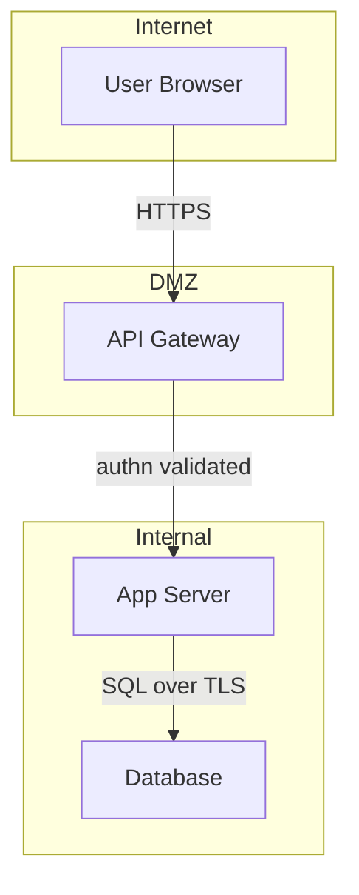

# Security Threat Model

Deliver an actionable, AppSec-grade threat model grounded in repository evidence. Every architectural claim maps to a concrete file path, symbol, or config key. Prioritize realistic attacker goals and concrete impacts over generic vulnerability checklists.

## Overview

This skill analyzes a codebase to produce a structured threat model following a data-flow and trust-boundary approach. It reads source code, configuration, and infrastructure files to identify components, entry points, assets, and security controls, then enumerates threats as concrete abuse paths tied to evidence in the repo.

**What it analyzes:**
- Application entry points (HTTP routes, RPC handlers, CLI parsers, message consumers)
- Trust boundaries between components (auth checks, network policies, TLS, sandboxing)
- Security-critical assets (credentials, PII, tokens, encryption keys, audit logs)
- Existing security controls (input validation, authZ, rate limiting, encryption at rest)
- Attack surface (file uploads, deserialization, dynamic code execution, SSRF-capable clients)

**What it produces:**
- A Markdown threat model file named `<repo-or-dir-name>-threat-model.md`
- Executive summary with top risk themes
- System model with Mermaid diagram of components and trust boundaries
- Asset inventory with security objectives (confidentiality, integrity, availability)
- Attacker model with capabilities and explicit non-capabilities
- Threat table with stable IDs (TM-001, TM-002), likelihood, impact, and priority
- Ranked abuse paths as multi-step attack sequences
- Concrete mitigations tied to specific code locations
- Focus paths for manual security review

## Analysis Checklist

### Scoping

- [ ] Identify repo root and in-scope paths
- [ ] Determine how the system runs (server, CLI, library, worker)
- [ ] Identify entrypoints and build artifacts
- [ ] Separate runtime behavior from CI/build/dev tooling and tests
- [ ] Collect deployment model, internet exposure, and auth expectations

### System Model

- [ ] Enumerate primary components, data stores, and external integrations
- [ ] Map data flows between components with protocol and auth details
- [ ] Identify trust boundaries with security guarantees at each edge
- [ ] Produce a Mermaid `flowchart TD` or `flowchart LR` diagram

### Asset Identification

- [ ] List assets that drive risk (credentials, PII, tokens, keys, config, models)
- [ ] Assign security objectives per asset (C/I/A)
- [ ] Identify entry points (endpoints, upload surfaces, parsers, job triggers)

### Threat Enumeration

- [ ] Enumerate threats as attacker stories tied to entry points and boundaries
- [ ] Classify each threat and map to impacted assets
- [ ] Prefer abuse paths (multi-step sequences) over single-line generic threats
- [ ] Assign stable threat IDs: TM-001, TM-002, etc.

### Risk Prioritization

- [ ] Rate likelihood (low/medium/high) with one-sentence justification
- [ ] Rate impact (low/medium/high) with one-sentence justification
- [ ] Set overall priority (critical/high/medium/low) using likelihood x impact
- [ ] State which assumptions most influence the ranking

### User Validation

- [ ] Summarize key assumptions affecting threat ranking
- [ ] Ask 1-3 targeted questions to resolve missing context
- [ ] Pause and wait for user feedback before producing the final report

### Mitigations

- [ ] Distinguish existing mitigations (with evidence) from recommended ones
- [ ] Tie mitigations to concrete locations (component, boundary, entry point)
- [ ] Provide specific implementation hints, not generic advice

## Metrics

### Threat Severity

| Priority | Criteria | Examples |
|----------|----------|----------|
| Critical | Pre-auth RCE, auth bypass, cross-tenant access | Unauthenticated command injection via API endpoint |
| High | Sensitive data exfiltration, key theft, sandbox escape | SSRF leading to internal service credential theft |
| Medium | Targeted DoS, partial data exposure, rate-limit bypass | Log poisoning that degrades detection capability |
| Low | Low-sensitivity info leaks, noisy DoS with easy mitigation | Version string disclosure requiring unlikely preconditions |

### Coverage

| Metric | Description | Target |
|--------|-------------|--------|
| Entry point coverage | Percentage of discovered entry points addressed in threats | 100% |
| Boundary coverage | Percentage of trust boundaries represented in threat table | 100% |
| Evidence anchors | Repo-path references per architectural claim | >= 1 per claim |
| Abuse paths | Multi-step attack sequences | 5-10 paths |
| Focus paths | Files/directories for manual review | 2-30 paths |

## Workflow

### Step 1: Scope the repository

Collect or infer inputs: repo root path, in-scope paths, intended usage, deployment model, internet exposure, and auth expectations. If unknown, mark as assumptions to validate with the user later.

```bash
# Identify languages and frameworks
find . -name "*.py" -o -name "*.js" -o -name "*.go" -o -name "*.rs" | head -20
# Check for infrastructure config
ls -la terraform/ kubernetes/ docker-compose.yml Dockerfile 2>/dev/null
# Identify entrypoints
grep -rn "app.run\|app.listen\|main()\|func main\|if __name__" --include="*.py" --include="*.go" --include="*.js" -l
```

### Step 2: Build the system model

Read source files to identify components, data stores, and external integrations. Map data flows and trust boundaries. Use `references/threat-model-methodology.md` for the evidence-collection process.

```bash
# Search for authentication and authorization surfaces
grep -rn "authenticate\|authorize\|@login_required\|jwt\|bearer\|session" --include="*.py" --include="*.js" -l
# Search for input parsing and deserialization
grep -rn "json.loads\|yaml.load\|xml.parse\|deserialize\|fromJSON" --include="*.py" --include="*.js" -l
# Search for network listeners and API routes
grep -rn "@app.route\|@router\|http.Handle\|express.Router\|grpc.Server" --include="*.py" --include="*.go" --include="*.js" -l
```

### Step 3: Identify assets and entry points

Enumerate assets (credentials, PII, tokens, keys, config) and entry points (endpoints, upload surfaces, parsers, job triggers). Use `references/security-controls-checklist.md` for the asset and control category reference.

### Step 4: Calibrate the attacker model

Describe realistic attacker capabilities based on exposure and intended usage. Explicitly note non-capabilities to prevent inflated severity ratings.

### Step 5: Enumerate threats as abuse paths

Generate threats as attacker stories tied to entry points, trust boundaries, and privileged components. Each threat gets a stable ID (TM-001, TM-002) and maps to impacted assets.

### Step 6: Prioritize threats

Apply qualitative likelihood x impact scoring. Adjust for existing controls. State which assumptions most affect the ranking.

### Step 7: Validate with user

Summarize 3-6 key assumptions that materially affect scope or risk ranking. Ask 1-3 targeted questions. Pause for user response before producing the final report.

### Step 8: Write mitigations and final report

For each high/critical threat, document existing mitigations with evidence, gaps, recommended mitigations, and detection ideas. Write the final Markdown to `<repo-name>-threat-model.md`.

## Report Format

### Summary

```
<repo-name> Threat Model
=========================
Scope: <in-scope paths>
Date: <ISO 8601 timestamp>

Top Risk Themes:
- <Theme 1: highest-priority finding>
- <Theme 2>
- <Theme 3>

Threats: <N> total (<critical> critical, <high> high, <medium> medium, <low> low)
Focus paths: <N> files/directories for manual review
```

### Required Sections

The output threat model must contain these sections in order:

1. **Executive summary** - One paragraph on top risk themes
2. **Scope and assumptions** - In-scope paths, out-of-scope items, explicit assumptions, open questions
3. **System model** - Primary components, data flows and trust boundaries, Mermaid diagram
4. **Assets and security objectives** - Table: Asset | Why it matters | Security objective (C/I/A)
5. **Attacker model** - Capabilities and non-capabilities
6. **Entry points and attack surfaces** - Table: Surface | How reached | Trust boundary | Notes | Evidence
7. **Top abuse paths** - 5-10 numbered multi-step sequences
8. **Threat model table** - Columns: Threat ID | Source | Prerequisites | Action | Impact | Assets | Existing controls | Gaps | Mitigations | Detection | Likelihood | Impact severity | Priority
9. **Criticality calibration** - What counts as critical/high/medium/low for this repo with 2-3 examples per level
10. **Focus paths for security review** - Table: Path | Why it matters | Related Threat IDs

### Diagram Rules

Use Mermaid `flowchart TD` or `flowchart LR` with:
- Simple node IDs (letters/numbers/underscores) and quoted labels (`A["Label"]`)
- Only `-->` arrows with plain-text edge labels via `-->|label|`
- No `title`, `style`, `{}`, `[]`, `()`, or quotes in edge labels
- Separate trust zones via subgraphs



## Examples

### Example 1: Full repository threat model

```
User: Threat model this repository at /home/user/project
Assistant: I'll build a threat model grounded in the repository's actual code.

Step 1: Scoping the repository...
- Languages: Python (FastAPI), TypeScript (React)
- Deployment: Docker containers on AWS ECS
- Entry points: 12 API routes, 1 WebSocket handler, 2 background workers

Step 2: Building system model...
- 4 components identified: API server, worker, PostgreSQL, Redis
- 6 trust boundaries mapped with auth and encryption details

Step 3: Identifying assets...
- 8 asset categories: user PII, JWT tokens, API keys, session data...

[Pausing for assumption validation]

Key assumptions:
1. Internet-facing API behind ALB with TLS termination
2. Single-tenant deployment
3. No multi-region replication

Questions:
1. Is the API publicly accessible or behind VPN?
2. What is the data sensitivity classification (PII, PHI, financial)?
3. Are background workers processing user-supplied content?

[After user confirmation, produces the full threat model]

Writing: project-threat-model.md (14 threats, 3 critical, 5 high)
```

### Example 2: Focused sub-path analysis

```
User: Threat model the auth/ directory
Assistant: Focusing threat analysis on auth/ subsystem...

Scoping: auth/ contains OAuth2 handler, session store, RBAC policy engine
Trust boundaries: 3 (browser-to-auth, auth-to-DB, auth-to-external-IdP)

Threats found:
- TM-001: Token replay via missing jti claim validation [HIGH]
- TM-002: Session fixation through predictable session ID generation [HIGH]
- TM-003: RBAC bypass via role escalation in policy.py:L142 [CRITICAL]

Writing: auth-threat-model.md
```

## Interpretation Guide

### Priority Levels

| Priority | Meaning | Action Required |
|----------|---------|-----------------|
| Critical | Exploitable pre-auth or leads to full compromise | Fix before next release |
| High | Significant data exposure or privilege escalation | Fix within current sprint |
| Medium | Measurable impact but requires specific preconditions | Plan remediation |
| Low | Minimal impact or requires unlikely preconditions | Track and address opportunistically |

### Evidence Anchor Format

Every architectural claim must include at least one evidence anchor:

```
Evidence: src/auth/handler.py:L42 (jwt.decode without verify_aud)
Evidence: config/nginx.conf (no rate_limit directive for /api/upload)
Evidence: k8s/deployment.yaml (securityContext.runAsNonRoot: false)
```

### Assumption Handling

Mark unresolved assumptions with their risk impact:

```
ASSUMPTION: Single-tenant deployment (if multi-tenant, TM-003 escalates to Critical)
ASSUMPTION: API behind VPN (if internet-facing, add TM-008 for credential stuffing)
```

## Quality Check

Before finalizing the threat model, verify:

- [ ] All discovered entry points are covered in the threat table
- [ ] Each trust boundary is represented in at least one threat
- [ ] Runtime vs CI/dev tooling separation is maintained
- [ ] User clarifications (or explicit non-responses) are reflected
- [ ] Assumptions and open questions are explicitly stated
- [ ] Evidence anchors reference real repo paths, not hypothetical ones
- [ ] Mermaid diagram renders cleanly with conservative syntax
- [ ] Threat IDs are stable and sequential (TM-001, TM-002, ...)

## References

- Threat modeling methodology and output contract: `references/threat-model-methodology.md`
- Security controls and asset categories checklist: `references/security-controls-checklist.md`

Only load the reference files when needed. Keep the final result concise, grounded, and reviewable.
